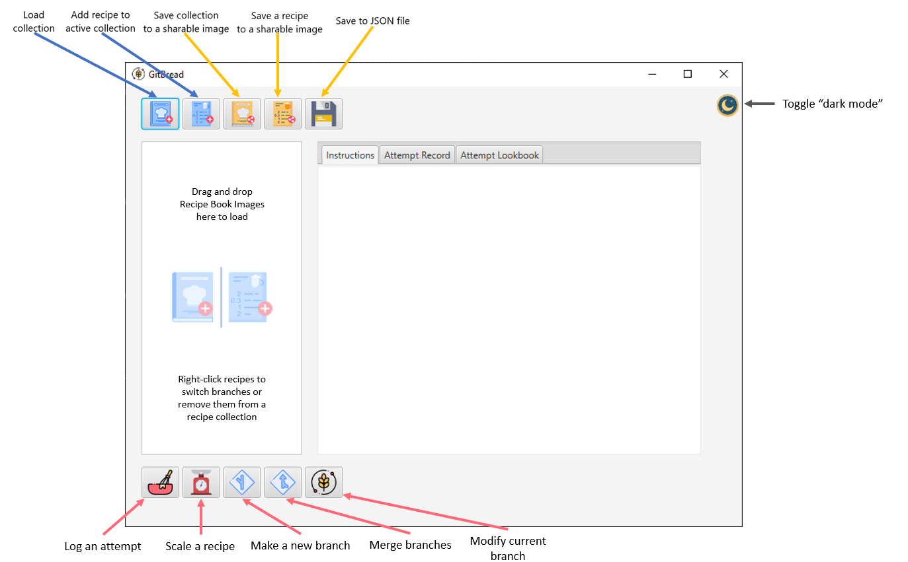

# GitBread

## Version control for baking (bread)

GitBread is a baking and recipe diary. It allows bakers to create or copy bread recipes 
to their recipe book, add notes, make modifications, and create new or improved recipes 
by recording variations in ingredients, cook times, cooking vessels and more. 

The GitBread concept of recipe version control is loosely based on [git](https://git-scm.com/),
a version control system for tracking changes in source code during software development.

GitBread is based on the concept of "Baker's Percentage", which expresses flour as 100% and all 
other ingredients as some percentage of the flour's weight. This method allows for quick and easy recipe scaling. 
You can read more about the this idea here: [King Arthur Flour: Bakers Percentage](https://www.kingarthurflour.com/pro/reference/bakers-percentage).

GitBread allows for things like:
- Recording recipes
- *branch* recipes to test variations
- *merge* changes back into your master recipe for when your changes improve the recipe
- Common bakers percentage calculations including support for preferments, poolish, hydration adjustments for milk and eggs, etc. 
- Record process notes like your kneading method, if you rested the dough, number and length of rises, autolyse, etc.
- Review your history of attempts and modifications for each recipe

 Anyone, beginner or expert, who wants to bake consistent loaves of bread or experiment and refine favorite recipes 
 will find the GitBread diary tool useful. Keep track of final recipes, the conditions that lead to the best version
 of an oft-baked bread, or simply go wild with experimentation knowing that you can easily look back at where you
 started and what you changed.
 

### Phase 1 User Stories

- As a user, I want to be able to add a recipe to my collection.
- As a user, I want to be able to view the titles of all my recipes.
- As a user, I want to be able to log an attempt of a recipe.
- As a user, I want to be able to view the number of times I have attempted a recipe.
- As a user, I want to be able scale a recipe up or down easily.
- As a user, I want to to be able to view the master version of a recipe.

### Phase 2 User Stories
- As a user, I want to to be asked if I want to save my collection when I quit the application.
- As a user, I want to be able to reload my collection to continue working on it. 

## Phase 3
### Instructions for Grader

- You can add a Recipe to a RecipeCollection by clicking the add recipe button 
- You can switch branches or remove a Recipe from the Recipe Collection in the right-click menu 
- You can record an attempt and the results using the attempt button 
- My visual component allows the user to add a photo to the attempt lookbook which is displayed in the Lookbook tab. Photos for the tester to use are located in ./data/images/attemptphotos/
- Recipe collections and recipes can also be added to the GUI by dragging and dropping exported images. The grader can save their own or find examples stored in ./data/icons/sharing/exported/ 
- You can load a bread recipe collection by clicking the add collection button 
- You can save the recipe collection as a JSON text file by clicking on the save button 
- You can save the recipe collection as an image by clicking on the export as image button 
- You can save an individual recipe as an image by clicking on the export as image button 

## Phase 4
Task 2:
1. I make use of a Map in my NodeGraph class. The Map<String, Node> mostRecentNodesByBranch field keeps track of the 
most recent commit in each existing branch so that the user can always navigate back to most recent change in any
branch.
2. NodeGraph is a robust class which can throw two unique exceptions: BranchAlreadyExistsException and BranchDoesNotExistException.
These are thrown in the commit(), merge(), newBranch(), checkout(), and getBranchHistory() methods and are tested in the
 TestNodeGraph class within the test package.

Task 3: 
1.  Every time I need an ObjectMapper for reading or creating JSON strings, I have to create a new mapper and register all 
the classes it needs to know about in my project to properly serialize and deserialize objects. This was a coupling and
 cohesion issue. Coupling because any time an ObjectMapper is needed that class also has to run the same class registration
 module for serializing/deserializing properly. Any time a new class was added I had to go and change the 4-5 ObjectMapper
 registration methods in different classes. Cohesion because each class which saved data was also managing an ObjectMapper. **Implemented ObjectMapperSingleton as a different class so 
that Jackson's ObjectMapper could implement the Singleton pattern. This allowed for replacing a lot of duplicated code in the 
NodeGraph and Reader classes.**

2. The NodeGraph class searches by default down the first parent (0th element of the parent list). This means that the 
NodeGraph class needs to know that Node has a parent list that has to be indexed into with an integer, which is a coupling issue.
**I refactored this class so that Node has a method called firstParent() which returns the first parent of the given Node.
This eliminates the need for NodeGraph to know anything about the concrete implementation of Node.**

3. My GUI setup and logic are in the same class together. This is a cohesion problem because my GUI class is managing 
both the look of the application and the logic behind the buttons/fields.

### Other refactoring
- Changed from a 1D linked-list to a graph structure for branching. Each node points backwards to a maximum of two
 parents, but can be the parent of an arbitrary number of nodes.
---
    		PREVIOUS DESIGN:    m<--m<--m<--t<--t<--m<--m<--a<--t<--a<--a<--m<--m<--m
    
                    REFACTOR:
                    
                                                        a<--a<--a
                                                       /          \
                                                  t<--t<--t        \
                                                 /                  \  
                                        m<--m<--m<--m<--m<-----------m<--m<--m
---

### Future User stories
- As a user, I want to be able to set my location by typing in my address or city.
- Automatically record the weather for the day you made your bread

